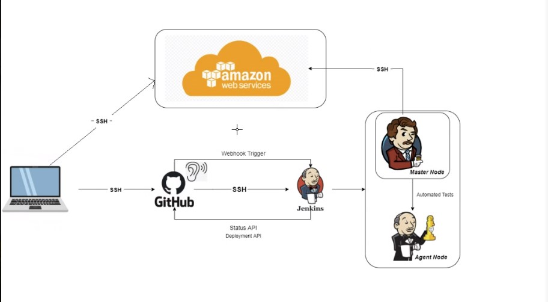

# Intro to CICD Pipeline

**CI/CD Pipeline** is a method to frequently deliver apps to customers by introducing automation into the stages of app development. The main concepts attributed to CI/CD are continuous integration, continuous delivery, and continuous deployment.

---

 

### Continuous Integration

Developers merge/commit code to master branch multiple times a day, fully automated build and test process which gives feedback within few minutes, by doing so, you avoid the integration hell that usually happens when people wait for release day to merge their changes into the release branch.

 

### Continuous Delivery

It is an extension of continuous integration to make sure that you can release new changes to your customers quickly in a sustainable way. This means that on top of having automated your testing, you also have automated your release process and you can deploy your application at any point of time by clicking on a button. In continuous Delivery the deployment is completed manually.

 

### Continuous Deployment

This goes one step further than continuous delivery, with this practice, every change that passes all stages of your production pipeline is released to your customers, there is no human intervention, and only a failed test will prevent a new change to be deployed to production.

 

---

### Jenkins
Jenkins is an open source automation server. It helps automate the parts of software development related to building, testing, and deploying, facilitating continuous integration and continuous delivery.

The image below displays Jenkins in action. **Webhook Trigger** triggers an actions so that Jenkins can continuously integrate the code.

 

---

### Webhook Trigger

Webhook triggers are an automatic type of trigger that listens for a certain type of data, much like event triggers. While event triggers are used for activating a trigger based on internal activity, webhooks are instead used when activating a trigger based on external activity.

 

---

#### Other CICD tools

---

### Why build a pipeline?
To fully automate the process of deployment. This can save days worh of time and prevent human error.
