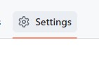
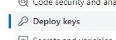

# testing account key

# Intro to CICD Pipeline

**CI/CD Pipeline** is a method to frequently deliver apps to customers by introducing automation into the stages of app development. The main concepts attributed to CI/CD are continuous integration, continuous delivery, and continuous deployment.

---

<br />

### Continuous Integration

Developers merge/commit code to master branch multiple times a day, fully automated build and test process which gives feedback within few minutes, by doing so, you avoid the integration hell that usually happens when people wait for release day to merge their changes into the release branch.

<br />

### Continuous Delivery

It is an extension of continuous integration to make sure that you can release new changes to your customers quickly in a sustainable way. This means that on top of having automated your testing, you also have automated your release process and you can deploy your application at any point of time by clicking on a button. In continuous Delivery the deployment is completed manually.

<br />

### Continuous Deployment

This goes one step further than continuous delivery, with this practice, every change that passes all stages of your production pipeline is released to your customers, there is no human intervention, and only a failed test will prevent a new change to be deployed to production.

<br />

---

## Jenkins
Jenkins is an open source automation server. It helps automate the parts of software development related to building, testing, and deploying, facilitating continuous integration and continuous delivery.

Benefits of using Jenkins:
- It is an open-source tool with great community support.
- It is easy to install.
- It has 1000+ plugins.
- It is free of cost.
- It is built with Java and hence, it is portable to all the major platforms.
  
  <br />


<br />

---

The image below displays Jenkins in action. **Webhook Trigger** triggers an actions so that Jenkins can continuously deploy the code.


<br />

### Using SSH key to connect to our GitHub repository


<br />

1. Open the repository we wish to add the key to
2. Click on "Settings" at the top



3. Click on "Deploy keys" on the let side



1. Put your generated public key and save it

<br />

---

### Webhook Trigger

Webhook triggers are an automatic type of trigger that listens for a certain type of data, much like event triggers. While event triggers are used for activating a trigger based on internal activity, webhooks are instead used when activating a trigger based on external activity.

Setting it up in GitHub first


<br />

---

### Other CICD tools


---


### Connect to AWS

**Webhook for dev branch:**
1. Restrict where this project can be run
2. Create a webhook in GitHub dev branch
3. Provide repository link (SSH)
4. Check GitHub Trigger
5. Provide Node plugin
6. Run the tests
   ```
   npm install
   npm test 
   ```
7. Trigger merge job if this job is done successfully


**Merging:**
1. Restrict where this project can be run
2. Provide Project URL (HHTP)
3. Provide repository link (SSH)
4. Add main and dev branches
5. Post-build Actions add "Push Only If Build Succeeds" and "Merge Results"


**Deploying:**
1. Restrict where this project can be run
2. Provide Project URL (HHTP)
3. Provide repository link (SSH)
4. Main branch
5. SSH Agent with pem key
6. Rsync to VM with public IP and run scripts from GitHub


```

rsync -avz -e "ssh -o StrictHostKeyChecking=no" app ubuntu@63.33.56.94:/home/ubuntu
rsync -avz -e "ssh -o StrictHostKeyChecking=no" environment ubuntu@63.33.56.94:/home/ubuntu
ssh -o "StrictHostKeyChecking=no" ubuntu@63.33.56.94 <<EOF
	cd .
    cd environment/app
    chmod +x provisions.sh
	sed -i -e 's/\r$//' provisions.sh
	./provisions.sh
    cd ~
    cd app
    npm install
    pm2 kill
    pm2 start app.js
EOF

```


