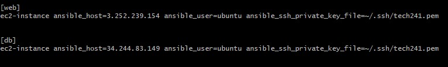
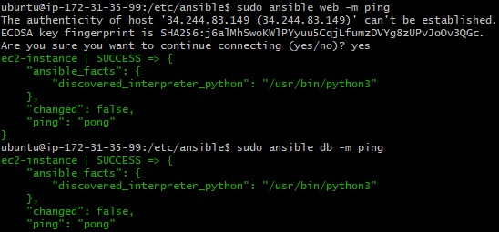

# Intro to Ansible

Ansible is a suite of software tools that enables infrastructure as code. It is open-source and the suite includes software provisioning, configuration management, and application deployment functionality.

Benefits of Ansible

Flexible: You can orchestrate the entire application environment no matter where it's deployed. You can also customize it based on your needs. 

Agentless: You don't need to install any other software or firewall ports on the client systems you want to automate.

1.	Update and upgrade on all machines to check internet connection
2.	Install ansible in the controller

```
sudo apt-get install software-properties-common
ansible --version
sudo apt install ansible
sudo apt-add-repository ppa:ansible/ansible
sudo apt update -y
sudo apt install anisible -y
```

3.	Check if hosts file is there

```
cd /etc/ansible/
ls
```

4.	Upload ssh pem file to the controller, change to chmod 400

```
cd ~/.ssh
sudo nano tech241.pem
sudo chmod 400 tech241.pem
```


5.	Check if ssh works to other machines

```
sudo ssh -i "tech241.pem" ubuntu@ec2-52-215-188-216.eu-west-1.compute.amazonaws.com

```

6.	cd /etc/ansible/ and nano hosts file to ping to the machines

```
cd /etc/ansible/
sudo nano hosts

```



7.	update upgrade to apply changes

```
sudo apt update -y
sudo apt upgrade -y

```


8.	sudo ansible web -m ping and expect pong

```
sudo ansible web -m ping

```


