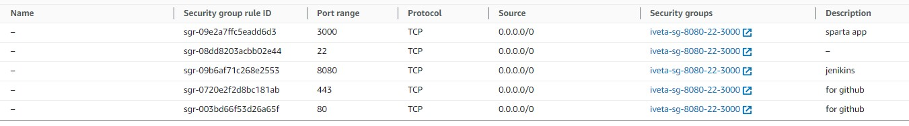
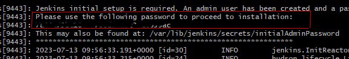

# Creating Jenkins Server

1. Create ec2 with the following security group



2. Ssh in

3. Install java

```
sudo apt update
sudo apt install openjdk-17-jre
```

4. Install LTS jenkins:

```
curl -fsSL https://pkg.jenkins.io/debian-stable/jenkins.io-2023.key | sudo tee \
  /usr/share/keyrings/jenkins-keyring.asc > /dev/null
echo deb [signed-by=/usr/share/keyrings/jenkins-keyring.asc] \
  https://pkg.jenkins.io/debian-stable binary/ | sudo tee \
  /etc/apt/sources.list.d/jenkins.list > /dev/null
sudo apt-get update
sudo apt-get install jenkins

```

5. Check if it's running

```
sudo systemctl status jenkins
```

6. Go to public IP + 8080 (jenkins port)

7. Use the password given after sudo systemctl status jenkins





8. Install recommaneded plug-is

9. Create account 

10. Install additional plug-ins:
- Office 365 Connector <- for sending a notification email
- Nodejs
- Agent SSH


11. Create new webhook on GitHub (jenkinsIP + 8080 port + IP + github-webhook/)

12. For nodejs plug-in Manage Jenkis -> Tools -> NodeJS, then pick version (version 12 in our case)
